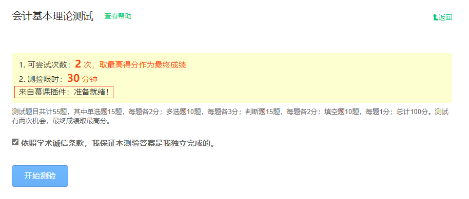

# 功能介绍

中国大学 MOOC 查询测验 / 作业 / 考试答案，提供插件支持，测验支持选择 / 判断 / 填空。

# 网页

网页地址：https://ginnnnnn.top/mooc/

# 插件

下载地址：https://ginnnnnn.top/mooc/extension/download/GinsMooc.zip

## 功能说明

- 获取中国大学慕课测验、作业、考试的参考答案，自动作答选择题，不包括 OJ 习题
- 自动完成互评中的评分、点评
- 不支持 “已关闭该学期” 的课程，除非在被关闭前就已经被查询过

## 安装教程

1. 点击上方下载地址下载压缩文件，并解压
2. 打开浏览器，点击右上角 “设置”，选择 “扩展”
   
3. 在弹出来的小窗中点击 “管理扩展”
    
4. 点击 “加载解压缩的扩展”
    

## 其他说明

1. 由于技术限制，测验中的填空题无法做到精确匹配，故暂不提供在当前页直接显示答案的功能
2. 提示 “并发限制” 是因为鼠标点击过快
3. 若无法获取答案，请尝试刷新页面再重新获取
4. 若出现任何问题，请及时前往[主页](https://ginnnnnn.top/mooc/)反馈问题
5. **该插件将只会在课程页面生效，且不会上传任何个人信息**